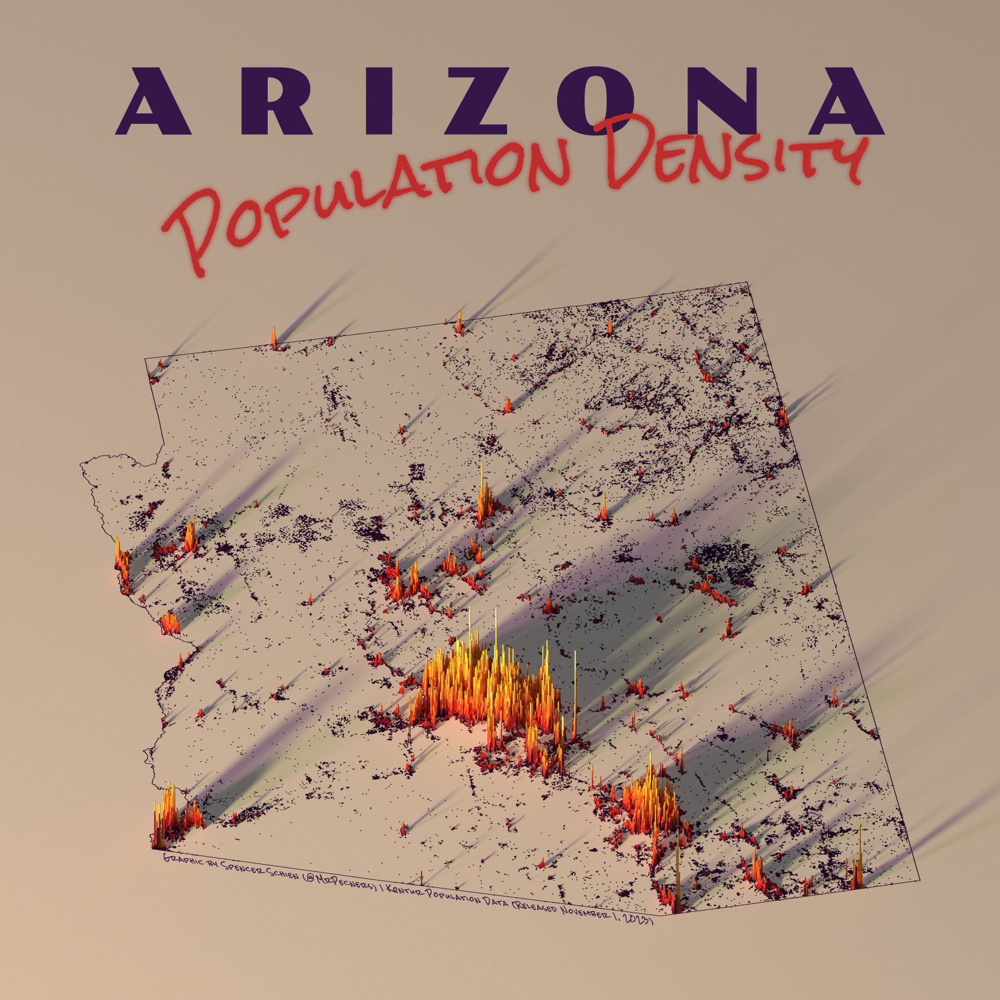

# Arizona

{.lightbox}

## Urban Areas {.unnumbered}

{.figure-right width=50%}

Arizona, the Grand Canyon State. The main urban areas of the state dominate this map, literally casting long shadows across unpopulated land. The greater Pheonix area sprawls while still maintining a clear start boundary  with the surrounding unpopulated land.

To the southwest of Pheonix is Tuscon, the other notable population center. Outside of those two, there are a number of small blips, but all the population clusters are confined to an area surrounded by unpopulated land.

## Concrete Rivers {.unnumbered}

Aside from the urban areas, the next characteristic that jumps out of this map is the serpentine pattern the population forms, not unlike rivers across a landscape.

